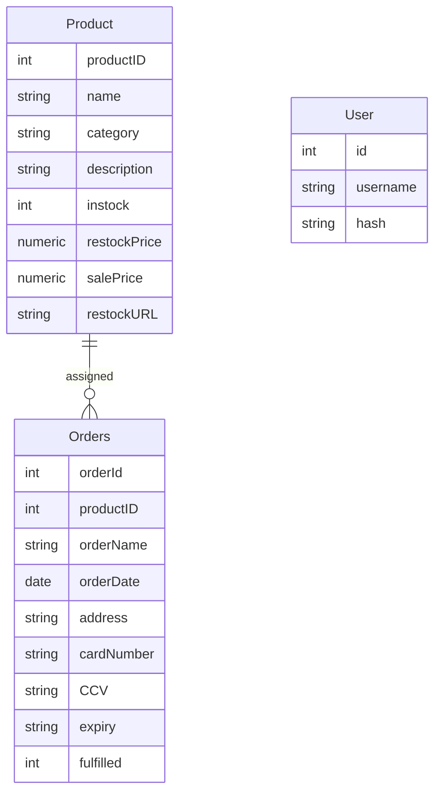

```mermaid
erDiagram
    Product {
        int productID
        string name
        string category
        string description
        int instock
        numeric restockPrice
        numeric salePrice
        string restockURL
    }
    Orders {
        int orderId
        int productID
        string orderName
        date orderDate
        string address
        string cardNumber
        string CCV
        string expiry
        int fulfilled
    }
    User {
        int id
        string username
        string hash
    }
    Product ||--o{ Orders : assigned

```
